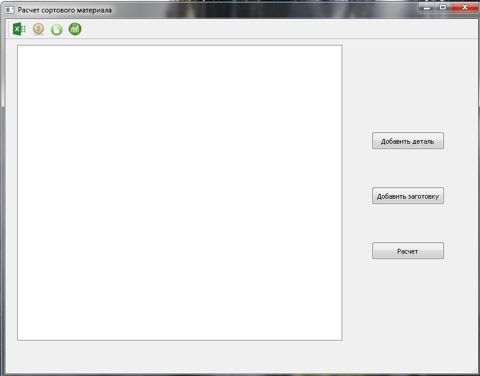
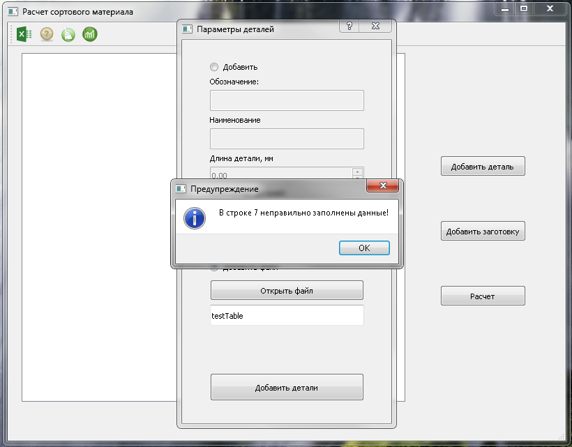
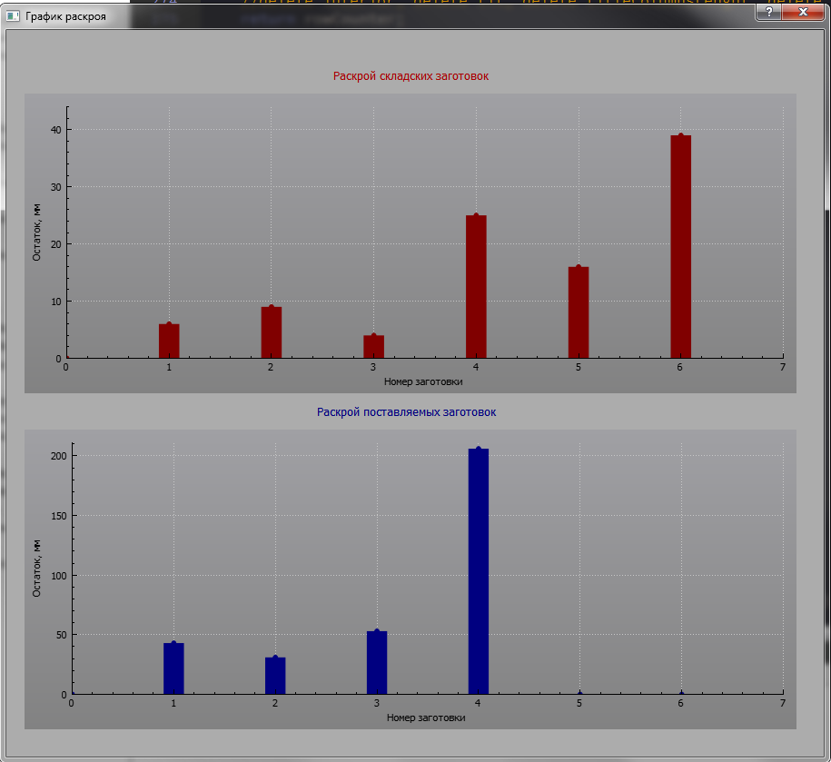
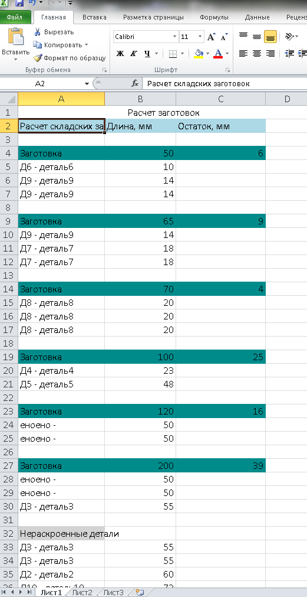

# linear_cutting
Программа, позволяющая рассчитать необходимое количество заготовок для изготовления деталей. В качестве расчета используется жадный алгоритм.
Добавление деталей и заготовок осуществляется вручную либо с помощью Excel. Примеры записи данных приведены в testToTable, testBarrStock, testBarrSupplier
Вывод результатов расчета: QTableWidget, result.xlsx(возможность записи данных в Excel файл).

.png)

